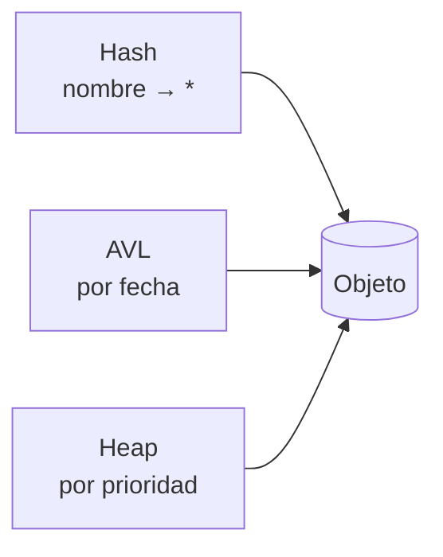
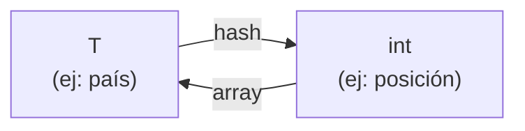
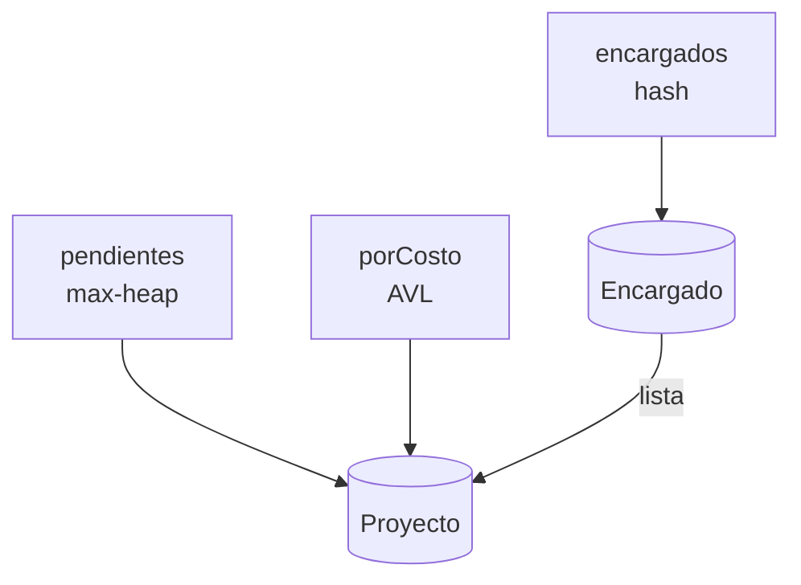
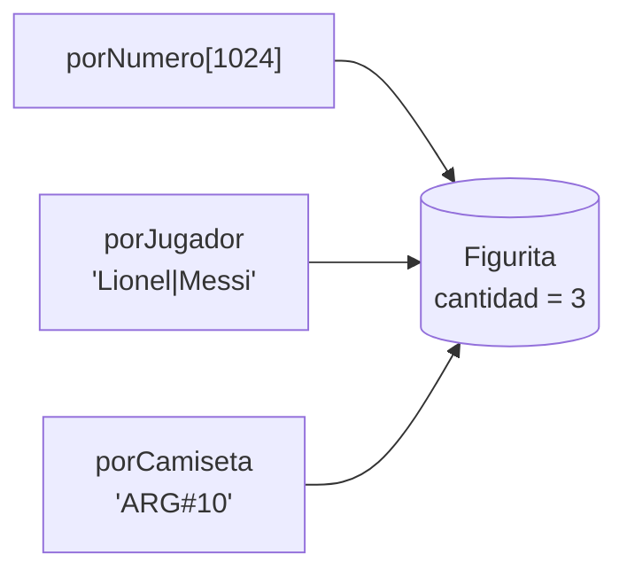

# Multiestructuras

El todo es mayor que la suma de las partes

<div class="abs-br m-6 text-sm opacity-50">
Estructuras de Datos y Algoritmos 2
</div>

<!--
Hoy no vemos ninguna estructura nueva. Vemos cómo COMBINAR las que ya conocemos.
Hilo: problema → herramientas → idea central → patrones → parciales.
-->

---

# Ranking FIFA

Se quiere almacenar y manipular el ranking FIFA de selecciones.

- Cada país nuevo entra **último** en el ranking.
- La única forma de subir es **retando** al que está justo arriba (el 4º reta al 3º, el 9º al 8º...).
- Si el retador gana, **intercambian posiciones**.

<br>

```cpp
void   agregarPais(string nombrePais);              // entra último
int    posicionRanking(string nombrePais);          // país -> posición
string posicionPais(int unaPosicion);               // posición -> país
void   retar(string paisRetador, bool ganoRetador); // swap con el de arriba si gana
```

<v-click>

> 🤔 Antes de seguir: **¿qué estructura usarías?**

</v-click>

<!--
Dejar que propongan. Aparecen típicamente: array, lista, AVL, hash.
-->

---

# Primer intento: un array

`ranking[pos] = país` responde muy bien la pregunta **posición → país**.

<div class="grid grid-cols-2 gap-8">
<div>

| operación | costo |
| --- | --- |
| `agregarPais` | <span v-click>O(1)</span> |
| `posicionPais` | <span v-click>O(1)</span> |
| `posicionRanking` | <span v-click>**O(N)** 😟 hay que recorrer</span> |
| `retar` | <span v-click>**O(N)** 😟 hay que encontrar al retador</span> |

</div>
<div>

<RankingFifa :conHash="false" />

</div>
</div>

<v-click>

El array es excelente para **posición → país**, pero el problema también pregunta **país → posición**.

</v-click>

<!--
Probar en vivo: posicionRanking("Croacia") recorre 7 casillas.
-->

---

# ¿Y con una tabla de hash `país → posición`?

<v-clicks>

- `posicionRanking` pasa a O(1) ✅
- pero `posicionPais(3)`... ¿quién está tercero? La tabla de hash **no sabe** responder eso: hay que recorrerla toda. O(N) 😟

</v-clicks>

<v-click>

<div class="mt-8 p-4 rounded bg-blue-500 bg-opacity-10">

Cada estructura responde **rápido** a **un tipo de pregunta**.

El problema tiene **dos preguntas distintas** sobre los mismos datos:

**posición → país** y **país → posición**.

</div>

</v-click>

<v-click>

Entonces... ¿por qué elegir una sola? 💡

</v-click>

---

# Repaso de costos

| | buscar | insertar | eliminar | ver máx | sacar máx | listar ordenado |
| --- | --- | --- | --- | --- | --- | --- |
| **Array indexado** (clave 0..K) | O(1) | O(1) | O(1) | O(K) | O(K) | O(K) |
| **Lista** | O(N) | O(1) | O(N) | O(N) | O(N) | O(N log N) |
| **AVL** | O(log N) | O(log N) | O(log N) | O(log N) | O(log N) | **O(N)** |
| **Heap** | O(N) | O(log N) | O(N) | **O(1)** | O(log N) | O(N log N) |
| **Hash** | **O(1) cp** | O(1) cp | O(1) cp | O(N) | O(N) | O(N log N) |

<br>

<v-click>

> **cp** = caso promedio. Ojo: en el peor caso, buscar en una tabla de hash es O(N).

</v-click>

<!--
Hacer notar la primera fila: el "array indexado por clave acotada" no siempre se nombra como estructura,
pero es muy útil cuando la clave es un entero chico (edad, nota, número de figurita, categoría).
-->

---

# Leerla al revés: ¿qué pregunta responde cada una?

<div class="grid grid-cols-2 gap-6 mt-4">
<div>

<v-clicks>

- 🔑 **"Dame el elemento con clave X"**
  → hash (O(1) cp) o AVL (O(log N))
- 🔢 **"Dame el elemento con clave entera X, chica y acotada"**
  → array indexado (O(1))
- 🏆 **"¿Cuál es el más prioritario?"**
  → heap (O(1))

</v-clicks>

</div>
<div>

<v-clicks>

- 📋 **"Listame todo ordenado por algo"**
  → AVL ordenado por ese algo (in-order, O(N))
- 🗂️ **"Dame los de la categoría X"**
  → array de categorías, y en cada casilla otra estructura

</v-clicks>

</div>
</div>

<v-click>

<div class="mt-6 text-center">

Este es el **diccionario** para traducir una operación de la letra a una estructura.

</div>

</v-click>

---

# Solución: array + hash

Usamos **las dos** estructuras a la vez. Cada una responde la pregunta en la que es buena.

<div class="grid grid-cols-2 gap-8">
<div>

- `ranking[pos]` → **posición → país**
- `posiciones[país]` → **país → posición**

<v-click>

| operación | costo |
| --- | --- |
| `agregarPais` | O(1) cp |
| `posicionRanking` | O(1) cp |
| `posicionPais` | O(1) |
| `retar` | O(1) cp |

</v-click>

</div>
<div>

<RankingFifa />

</div>
</div>

<!--
Probar en vivo: retar con Uruguay. Se iluminan DOS filas en el array y DOS en el hash.
Preguntar: ¿qué pasa si me olvido de actualizar el hash?
Notar que la tabla de hash está ordenada por bucket, no por posición: no "sabe" el orden.
-->

---

# El código

<<< @/snippets/ranking_fifa.cpp {all|2-4|13-17|19-21|23-25|27-38|32-34|35-37|all}{maxHeight:'400px'}

<!--
Líneas 35-37: retar ahora hace trabajo en DOS estructuras.
Cada operación que modifica datos tiene que tocar TODAS las estructuras afectadas.
-->

---

# ¿Qué es una multiestructura?

**Multi → estructura**: una estructura formada por **varias estructuras** que ya conocemos, trabajando juntas sobre **la misma información**. Cada una actúa como un **índice** para un tipo de pregunta.

<v-click>

Es lo mismo que hace una base de datos cuando crea un índice por cada columna que se consulta seguido.

</v-click>

<v-click>

<div class="mt-6 grid grid-cols-3 gap-4 text-center">
<div class="p-3 rounded bg-green-500 bg-opacity-10">

**Consultas** ⚡

cada una usa el índice adecuado

</div>
<div class="p-3 rounded bg-yellow-500 bg-opacity-10">

**Modificaciones** 🐢

tienen que actualizar **todos** los índices

</div>
<div class="p-3 rounded bg-red-500 bg-opacity-10">

**Memoria** 📦

las **claves** se repiten en cada índice; los **objetos**, no

</div>
</div>

</v-click>

---

# El invariante: lo que nunca se puede romper

Si hay varias estructuras, tienen que **decir lo mismo**. Esa regla se llama **invariante**.

<v-click>

En el Ranking FIFA:

$$
\forall\, i \in [1, N]: \quad \text{posiciones}[\,\text{ranking}[i]\,] = i
$$

</v-click>

<v-clicks>

- Cada operación **asume** que el invariante se cumple al empezar.
- Cada operación **garantiza** que el invariante se cumple al terminar.
- `retar` hace swap en el array → **tiene que** actualizar las 2 entradas del hash.

</v-clicks>

<v-click>

> ⚠️ Error común en parciales: alguna operación actualiza **solo una** de las estructuras.

</v-click>

---

# No duplicar información: punteros

Los **objetos** se crean **una vez**, y cada estructura guarda un **puntero**.

<div class="grid grid-cols-[2fr_3fr] gap-6 items-center">
<div>



</div>
<div>

<v-clicks>

- Si un dato cambia (por ejemplo `cantidad++`), se cambia **en un solo lugar** y todos los índices lo ven.
- Cada AVL o heap recibe **su propia función de comparación**: así sabe por qué campo ordenar.
- Si cambia el dato **por el que una estructura ordena**, hay que **sacar y volver a insertar** en esa estructura.

</v-clicks>

</div>
</div>

---

# Un patrón: traducción `T ↔ int`

Lo que hicimos en el Ranking FIFA aparece seguido: **hash `T → int`** + **array `int → T`**.



<v-clicks>

- Le da un **número** a cada elemento con nombre, y permite volver del número al elemento.
- En **grafos**: los vértices tienen nombre, pero los algoritmos trabajan con `0..V-1`.
- En **heaps**: guardar en qué posición del heap está cada elemento, para encontrarlo en O(1).

</v-clicks>

<v-click>

> El resto depende de cada letra: se elige una estructura por cada **pregunta** que hace el problema.

</v-click>

---
zoom: 0.9
---

# 📁 Parcial octubre 2019 · Proyectos

<Letra parcial="Parcial · 23/10/2019 · Matutino" ejercicio="Ejercicio 2" pdf="/parciales/parcial-2019-10-matutino.pdf">

Se solicita realizar un sistema de gestión de proyectos que resuelven problemas en una empresa. Los proyectos tienen un **nombre** (se asume único ✏️), una **prioridad**, un **costo** y un **encargado**. Se requieren las siguientes operaciones:

1. **Agregar un proyecto.** Dados los datos de un proyecto, se desea agregarlo al sistema para su futura ejecución. **O(log n) peor caso**, n = cantidad total de proyectos ✏️.
2. **Ejecutar proyectos.** Ejecutar, a lo sumo, los **K proyectos más prioritarios** siempre que la suma de costos no supere un presupuesto **D**. Si el siguiente proyecto no entra en el presupuesto, se detiene ✏️. Retorna los nombres de los proyectos ejecutados. **O(K · log n) peor caso**, n = proyectos sin ejecutar.
3. **Listado de proyectos y encargados.** Listar los nombres de los proyectos con sus encargados, **ordenado por costo** ✏️. **O(n) peor caso**, n = cantidad total de proyectos.
4. **Proyectos de un encargado.** Dado el nombre de un encargado (se asume único), retornar la lista de sus proyectos ✏️. **O(1) caso promedio**.

**Se solicita:** realizar un boceto de la solución y justificar los tiempos; indicar en C++ los tipos de las estructuras elegidas; implementar la operación 2: `retornoNombres ejecutarKProyectosMasPrioritarios(int K, int D)`.

<div class="text-xs opacity-70 mt-1">✏️ Corregido respecto al original: decía "ordenado por <b>precio</b>" (el proyecto tiene <b>costo</b>); no definía n en la operación 1 ni qué hacer si un proyecto no entra en el presupuesto; "retornar un listado" en O(1) solo es posible devolviendo la lista ya guardada, no una copia.</div>

</Letra>

<v-click>

<div class="text-sm mt-2">⏸ Antes de seguir: ¿qué pregunta hace cada operación?</div>

</v-click>

---

# 📁 Operaciones → preguntas → estructuras

<div class="grid grid-cols-[3fr_2fr] gap-6">
<div>

<v-clicks>

- **2) los K más prioritarios** → **max-heap** de proyectos **sin ejecutar**, por prioridad
- **3) listar ordenado por costo** → **AVL por costo** (empate: nombre), con **todos** los proyectos
- **4) proyectos de un encargado** → "dame por clave" → **hash `nombre → Encargado*`**, y cada encargado guarda **su lista** de proyectos
- **1) agregar** → insertar en **las tres**

</v-clicks>

</div>
<div v-click>



</div>
</div>

<v-click>

> ⚠️ Ojo con **qué es n**: en la operación 2 son los proyectos **sin ejecutar**; en la 3, **todos**. Por eso el heap y el AVL no guardan lo mismo.

</v-click>

---

# 📁 La operación 2

<<< @/snippets/proyectos.cpp {all|1-4|6-9|12-14|17-28|20|21|22-25|27|all}{maxHeight:'400px'}

<!--
Línea 21: si el más prioritario no entra en el presupuesto, se detiene (es lo que aclaramos en la letra).
Si en cambio "lo salteara" para buscar uno más barato, podría recorrer muchos más de K proyectos y la cota O(K log n) no se cumpliría.
El proyecto ejecutado sale del heap, pero sigue en el AVL y en la lista de su encargado: la operación 3 lista TODOS.
-->

---
zoom: 0.92
---

# 📁 Costos

| operación | pedido | logrado |
| --- | --- | --- |
| Agregar | O(log n) | heap O(log n) + AVL O(log n) + encargado O(1) cp ⇒ **O(log n)** ✅ * |
| Ejecutar | O(K log n) | a lo sumo K veces `top` + `pop` ⇒ **O(K log n)** ✅ |
| Listado | O(n) | in-order del AVL ⇒ **O(n)** ✅ |
| Proyectos de un encargado | O(1) cp | `get` en el hash + devolver su lista ⇒ **O(1) cp** ✅ |

<v-click>

<div class="mt-4 p-4 rounded bg-yellow-500 bg-opacity-10 text-sm">

\* **Para discutir:** al agregar hay que **buscar al encargado** en el hash, y eso es O(1) en el caso promedio pero O(n) en el peor. La letra pide O(log n) **peor caso**...

¿Cómo se arregla? Un hash cuyos buckets son **AVLs** en vez de listas: buscar sigue siendo O(1) cp, y en el peor caso es O(log n).

</div>

</v-click>

---

# 🃏 Parcial mayo 2026 · Figuritas

<Letra parcial="Primer parcial especial · 13/05/2026" ejercicio="Ejercicio 2 · 10 puntos" pdf="/parciales/parcial-2026-05-matutino.pdf">

Un coleccionista está armando una aplicación para gestionar las figuritas del Mundial que tiene en su poder. La comunicación entre coleccionistas se vuelve difícil porque cada uno se refiere a las figuritas de forma distinta:

- Algunos por **nombre y apellido** del jugador (asumir que la combinación es única).
- Otros por el **número de figurita** (entero entre 0 y 1023).
- Otros por la combinación **nacionalidad + número de camiseta** (asumir que también es única).

Se quiere que la aplicación responda **cuántas copias** tiene el coleccionista de una figurita según cualquiera de los tres criterios, de la manera más eficiente posible dados los temas vistos en el curso.

**A.** ¿Qué estructura(s) de datos utilizaría para soportar las consultas por los tres criterios? Justificar.

**B.** Implementar las siguientes operaciones e indicar su orden temporal, asumiendo la representación diseñada en la parte A:

- `void agregarFigurita(string nombre, string apellido, int numeroFigurita, string nacionalidad, int numeroCamiseta)`: la agrega con cantidad 1; si ya existía, incrementa su cantidad en 1.
- `int cuantasTengo(string nombre, string apellido)`: devuelve la cantidad de copias, o 0 si no la tiene.
- `void cambio(Figurita doy, Figurita recibo)`: entregó una copia de `doy` (asumir cantidad ≥ 2) y recibió una de `recibo`. Si `recibo` ya existía, incrementa su cantidad; si no, la agrega.

</Letra>

---

# 🃏 Un índice por criterio

<div class="grid grid-cols-2 gap-6 items-center">
<div>

| se pregunta por... | estructura |
| --- | --- |
| nombre + apellido | <span v-click>hash `string → Figurita*`</span> |
| número (**0..1023** 👀) | <span v-click>**array** `Figurita*[1024]`</span> |
| nacionalidad + camiseta | <span v-click>hash `string → Figurita*`</span> |

</div>
<div v-click>



</div>
</div>

<v-clicks>

- La `cantidad` vive **en un solo lugar**: los tres índices apuntan al **mismo** objeto.
- **Clave compuesta** con **separador**: sin él, `"Ana" + "Maria Lopez"` y `"Ana Maria" + "Lopez"` dan la misma clave.

</v-clicks>

---

# 🃏 El código

<<< @/snippets/figuritas.cpp {all|1-6|9-11|13-18|21-25|27-38|29|30-33|34-37|40-44|46-50|all}{maxHeight:'400px'}

<!--
Línea 29: "¿ya la tengo?" se pregunta por el índice más barato: el array.
Línea 23: tamaño fijo, porque hay como mucho 1024 figuritas → nunca hay rehash.
-->

---
zoom: 0.92
---

# 🃏 Costos

| operación | costo | por qué |
| --- | --- | --- |
| `agregarFigurita` (ya existía) | **O(1)** | solo el array + `cantidad++` |
| `agregarFigurita` (nueva) | **O(1) cp** | array + 2 inserciones en hash |
| `cuantasTengo` | **O(1) cp** | 1 búsqueda en hash |
| `cambio` | **O(1) cp** | array para `doy` + `agregarFigurita(recibo)` |

<v-click>

<div class="mt-6 p-4 rounded bg-purple-500 bg-opacity-10">

🤔 **Pregunta trampa:** como hay como mucho 1024 figuritas, para `cuantasTengo` podría recorrer el array entero... ¿eso también es O(1)?

</div>

</v-click>

<v-click>

Recorrerlo son hasta **1024** comparaciones de `string`; el hash hace ~**1**. La letra pide *"la más eficiente posible"* → hash.

</v-click>

---
zoom: 0.88
---

# Para llevarse

| la letra dice... | pensá en... |
| --- | --- |
| "dado el nombre / código..." | tabla de hash (o AVL) |
| "un número entre 0 y K" | **array indexado** |
| "el más / menos prioritario" | heap |
| "listar ordenado por X" | AVL ordenado por X |
| "los de la categoría / edad X" | array (o hash) de estructuras |
| "la posición de X" **y** "quién está en la posición i" | hash + array (`T ↔ int`) |
| "buscar por A, por B o por C" | un índice por clave, todos al mismo objeto |

<div class="mt-4 text-sm">

📄 Letras completas: <PdfLink href="/parciales/parcial-2019-10-matutino.pdf">parcial octubre 2019</PdfLink> · <PdfLink href="/parciales/parcial-2026-05-matutino.pdf">parcial mayo 2026</PdfLink>

</div>
