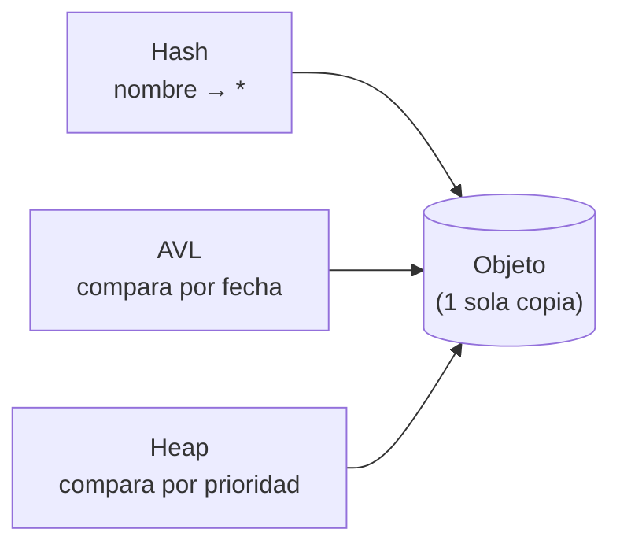
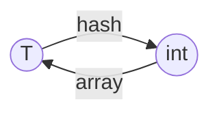
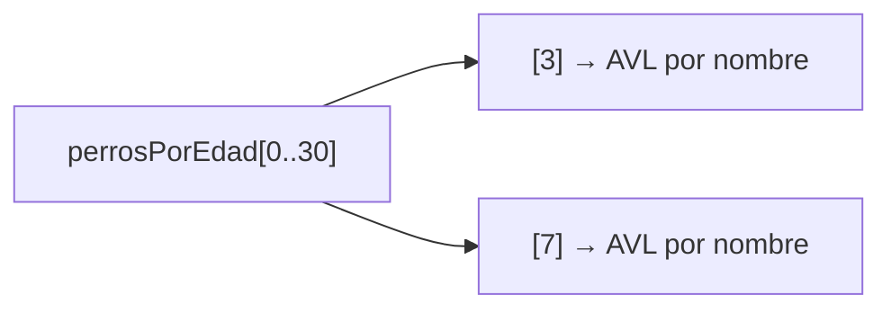
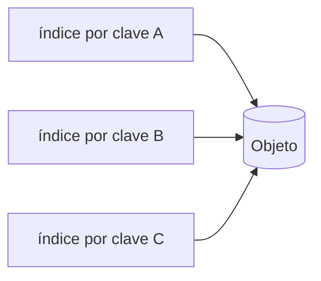
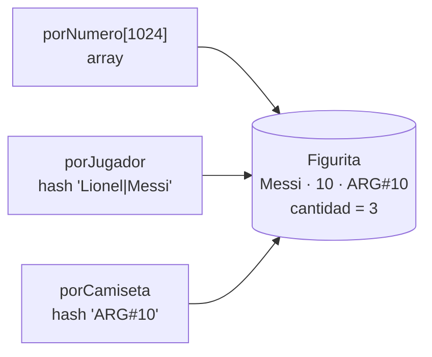
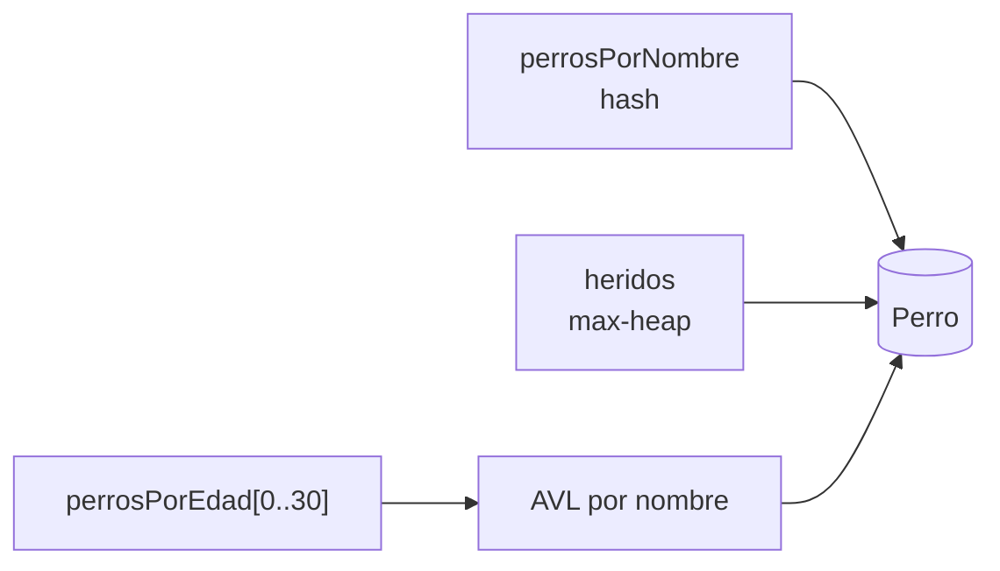
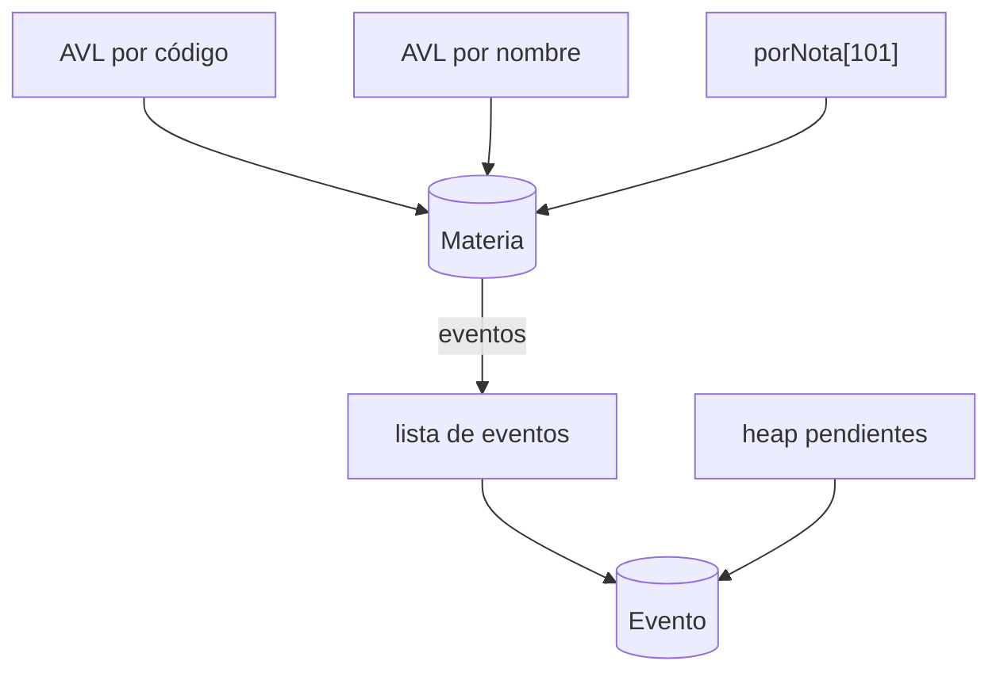

# Multiestructuras

El todo es mayor que la suma de las partes

<div class="abs-br m-6 text-sm opacity-50">
Estructuras de Datos y Algoritmos 2
</div>

<!--
Hoy no vemos ninguna estructura nueva. Vemos cómo COMBINAR las que ya conocemos.
Es el tipo de ejercicio que aparece en casi todos los primeros parciales.
-->

---

# El plan de hoy

<v-clicks>

1. **Un problema** que ninguna estructura sola resuelve bien
2. **La caja de herramientas**: qué pregunta responde rápido cada estructura
3. **La idea central**: una misma información, varios índices
4. **Un método** de 5 pasos para los parciales
5. **Patrones** que se repiten
6. **Tres parciales reales**, de menor a mayor dificultad

</v-clicks>

<!--
El hilo: problema → herramientas → idea → método → patrones → parciales.
Al final de la clase tienen que poder enfrentar una letra nueva aplicando el método, no memorizando soluciones.
-->

---
layout: section
---

# 1. Un problema

Ranking FIFA

---

# Ranking FIFA

Se quiere almacenar y manipular el ranking FIFA de selecciones.

- Cada país nuevo entra **último** en el ranking.
- La única forma de subir es **retando** al que está justo arriba (el 4º reta al 3º, el 9º al 8º...).
- Si el retador gana, **intercambian posiciones**.

<br>

```cpp
void   agregarPais(string nombrePais);              // entra último
int    posicionRanking(string nombrePais);          // país -> posición
string posicionPais(int unaPosicion);               // posición -> país
void   retar(string paisRetador, bool ganoRetador); // swap con el de arriba si gana
```

<v-click>

> 🤔 Antes de seguir: **¿qué estructura usarías?** Pensalo 1 minuto.

</v-click>

<!--
Dejar que propongan. Aparecen típicamente: array, lista, AVL, hash.
Anotar en el pizarrón las propuestas y volver a ellas en la próxima slide.
-->

---

# Primer intento: un array

`ranking[pos] = país` responde muy bien la pregunta **posición → país**.

<div class="grid grid-cols-2 gap-8">
<div>

| operación | costo |
| --- | --- |
| `agregarPais` | <span v-click>O(1)</span> |
| `posicionPais` | <span v-click>O(1) pc</span> |
| `posicionRanking` | <span v-click>**O(N)** 😟 hay que recorrer</span> |
| `retar` | <span v-click>**O(N)** 😟 hay que encontrar al retador</span> |

<div class="text-xs opacity-70 mt-2">

**pc** = peor caso · **cp** = caso promedio · **N** = cantidad de países

</div>

</div>
<div>

<RankingFifa :conHash="false" />

</div>
</div>

<v-click>

El array es excelente para **posición → país**, pero el problema también pregunta **país → posición**.

</v-click>

<!--
Probar en vivo: posicionRanking("Croacia") recorre 7 casillas.
Remarcar: el array no es "malo", responde muy bien UNA de las dos preguntas.
-->

---

# ¿Y con una tabla de hash `país → posición`?

<v-clicks>

- `posicionRanking` pasa a O(1) cp ✅
- pero `posicionPais(3)`... ¿quién está tercero? La tabla de hash **no sabe** responder eso: hay que recorrerla toda. O(N) 😟

</v-clicks>

<v-click>

<div class="mt-8 p-4 rounded bg-blue-500 bg-opacity-10">

Cada estructura responde **rápido** a **un tipo de pregunta**.

El problema tiene **dos preguntas distintas** sobre los mismos datos:

**posición → país** y **país → posición**.

</div>

</v-click>

<v-click>

Entonces... ¿por qué elegir una sola? 💡

</v-click>

<!--
Este es el "aha" de la clase. Todavía no damos la solución: primero repasamos qué pregunta responde cada estructura.
-->

---
layout: section
---

# 2. La caja de herramientas

Qué pregunta responde rápido cada estructura

---
zoom: 0.88
---

# Repaso de costos

<div class="text-xs">

| | buscar por clave | insertar | eliminar uno dado | ver el máx\* | sacar el máx\* | listar ordenado |
| --- | --- | --- | --- | --- | --- | --- |
| **Array indexado** (clave 0..K) | O(1) pc | O(1) pc | O(1) pc | O(K) | O(K) | O(K) |
| **Lista** | O(N) | O(1) al principio | O(N) · O(1) si tengo el nodo ³ | O(N) | O(N) | O(N log N) |
| **ABB** ⁴ | O(log N) cp | O(log N) cp | O(log N) cp | O(log N) cp | O(log N) cp | O(N) |
| **AVL** | O(log N) pc | O(log N) pc | O(log N) pc | O(log N) pc | O(log N) pc | **O(N) pc** |
| **Heap** (max-heap) | O(N) | O(log N) pc ¹ | O(N) | **O(1) pc** | O(log N) pc | O(N log N) |
| **Hash** (abierto, B buckets) | **O(1) cp** · O(N) pc | O(1) cp · O(N) pc ² | O(1) cp · O(N) pc | O(B + N) | O(B + N) | O(N log N) |

</div>

<div class="text-xs mt-2 opacity-80">

\* o el mínimo, según el orden de la estructura. Un max-heap da el **máximo** en O(1); el mínimo le cuesta O(N).
¹ Solo si el array del heap tiene **capacidad fija**. Si se duplica al llenarse, ese insert cuesta O(N).
² O(N) pc si busca **duplicados** antes de insertar, o si hace **rehash**. Insertar al principio del bucket sin buscar es O(1) pc, pero solo vale si la letra garantiza que la clave no existe, o si lo suponés y lo escribís.
³ Con una lista **doblemente** enlazada. ⁴ En el peor caso (árbol degenerado) todas cuestan O(N).

</div>

<v-click>

> ⚠️ Regla para los parciales: **buscar** en una tabla de hash **nunca** es O(1) en el peor caso.

</v-click>

<!--
Hacer notar la primera fila: el "array indexado por clave acotada" no siempre se nombra como estructura,
pero es la herramienta más poderosa cuando la clave es un entero chico (edad, nota, número de figurita, categoría).
Las notas ¹ y ² son las dos trampas que vamos a ver en el parcial del refugio.
-->

---

# Leerla al revés: ¿qué pregunta responde cada una?

<div class="grid grid-cols-2 gap-6 mt-4">
<div>

<v-clicks>

- 🔑 **"Dame el elemento con clave X"**
  → hash (O(1) cp) o AVL (O(log N) pc)
- 🔢 **"Dame el elemento con clave entera X, con X chica y acotada"**
  → array indexado (O(1) pc)
- 🏆 **"¿Cuál es el más prioritario?"**
  → heap (O(1) pc)

</v-clicks>

</div>
<div>

<v-clicks>

- 📋 **"Listame todo ordenado por algo"**
  → AVL ordenado por ese algo (recorrida in-order: izquierda, raíz, derecha → O(N))
- 🗂️ **"Dame los de la categoría X"**
  → array de categorías, y en cada casilla otra estructura

</v-clicks>

</div>
</div>

<v-click>

<div class="mt-6 text-center">

Este es el **diccionario** que usamos para traducir una operación de la letra a una estructura.

</div>

</v-click>

<!--
Esta slide es la base del método. Volvemos a ella en cada parcial.
-->

---
layout: section
---

# 3. La idea central

Una misma información, varios índices

---

# Solución: array + hash

Usamos **las dos** estructuras a la vez. Cada una responde la pregunta en la que es buena.

<div class="grid grid-cols-2 gap-8">
<div>

- `ranking[pos]` → **posición → país**
- `posiciones[país]` → **país → posición**

<v-click>

| operación | costo |
| --- | --- |
| `agregarPais` | O(1) pc |
| `posicionRanking` | O(1) cp |
| `posicionPais` | O(1) pc |
| `retar` | O(1) cp |

</v-click>

</div>
<div>

<RankingFifa />

</div>
</div>

<!--
Probar en vivo: retar con Uruguay. Se iluminan DOS filas en el array y DOS en el hash.
Preguntar: ¿qué pasa si me olvido de actualizar el hash? → la próxima posicionRanking da cualquier cosa.
Notar que la tabla de hash está ordenada por bucket, no por posición: no "sabe" el orden.
-->

---

# El código

<<< @/snippets/ranking_fifa.cpp {all|2-4|7-11|13-17|19-21|23-25|27-38|32-34|35-37|all}{maxHeight:'400px'}

<!--
Líneas 35-37: retar ahora hace trabajo en DOS estructuras.
Cada operación que modifica datos tiene que tocar TODAS las estructuras afectadas.
Línea 27: la precondición viene de la letra ("no está en el primer puesto"). Sin ella, ranking[0] es basura.
-->

---

# Lo que acabamos de hacer tiene nombre

Una **multiestructura** es un TAD que, por dentro, guarda **la misma información** en varias estructuras que ya conocemos. Cada una actúa como un **índice** para un tipo de pregunta.

<v-click>

Es lo mismo que hace una base de datos cuando crea un índice por cada columna que se consulta seguido.

</v-click>

<v-click>

<div class="mt-6 grid grid-cols-3 gap-4 text-center">
<div class="p-3 rounded bg-green-500 bg-opacity-10">

**Consultas** ⚡

cada una usa el índice adecuado

</div>
<div class="p-3 rounded bg-yellow-500 bg-opacity-10">

**Modificaciones** 🐢

tienen que actualizar **todos** los índices

</div>
<div class="p-3 rounded bg-red-500 bg-opacity-10">

**Memoria** 📦

las **claves** se repiten en cada índice; los **objetos**, no

</div>
</div>

</v-click>

<!--
El trade-off es siempre el mismo: pagamos un poco más al modificar y en memoria, para que las consultas sean rápidas.
En FIFA el nombre del país está en el array y en el hash: repetir la CLAVE es inevitable y aceptable.
Lo que no se repite son los objetos con datos (próxima slide).
-->

---

# El invariante: lo que nunca se puede romper

Si hay varias estructuras, tienen que **decir lo mismo**. Esa regla se llama **invariante**.

<v-click>

En el Ranking FIFA:

$$
\forall\, i \in [1, N]: \quad \text{posiciones}[\,\text{ranking}[i]\,] = i
\qquad\text{y en el hash no hay otros países}
$$

</v-click>

<v-clicks>

- Cada operación **asume** que el invariante se cumple al empezar.
- Cada operación **garantiza** que el invariante se cumple al terminar.
- `retar` hace swap en el array → **tiene que** actualizar las 2 entradas del hash.

</v-clicks>

<v-click>

> ⚠️ El error más común en parciales: se diseñan bien las estructuras, pero alguna operación actualiza **solo una** de ellas.

</v-click>

---

# No duplicar información: punteros

Si guardamos **objetos** con datos, no los copiamos en cada estructura: los creamos **una vez** y cada estructura guarda un **puntero**.



<v-clicks>

- Si un dato del objeto cambia (por ejemplo `cantidad++`), se cambia **en un solo lugar** y todos los índices lo ven.
- ¿Cómo sabe cada AVL o heap por qué campo ordenar? Cada uno recibe **su propia función de comparación**.
- Si cambia el dato **por el que una estructura ordena** (la prioridad en el heap, la clave del AVL), hay que **sacar y volver a insertar** en esa estructura.
- Varias letras de parcial lo piden explícitamente: *"sin duplicar información"*.

</v-clicks>

---
layout: section
---

# 4. El método

5 pasos para cualquier letra

---

# El método en 5 pasos

<v-clicks>

1. **Listar las operaciones** con su cota exacta. Marcar si la cota es **pc** o **cp** y qué significa cada **n**.
2. **Traducir cada operación a una pregunta** ("dame por clave", "dame el máximo", "listame ordenado"...) y buscar en el diccionario qué estructura la responde.
3. **Decidir qué se guarda y dónde**: objetos una sola vez, y punteros en los índices. Dibujar el diagrama y escribir el **invariante**.
4. **Recorrer cada operación por todas las estructuras** y sumar costos. Las operaciones que **modifican** son las peligrosas: tocan todos los índices.
5. **Verificar contra la letra**: ¿el término dominante cumple la cota? ¿pc o cp? ¿alguna estructura se redimensiona?

</v-clicks>

<!--
Paso 4 es donde se pierden más puntos: diseñan la consulta, pero se olvidan de que el agregar tiene que insertar en TODAS las estructuras,
y que la cota del agregar es la suma (es decir el máximo) de todos esos costos.
-->

---

# Trampas frecuentes

<v-clicks>

- 🪤 **"pc" con una tabla de hash.** Buscar en hash es O(1) **cp** pero O(N) **pc**. Si la letra pide pc, el hash solo no alcanza.
- 🪤 **Eliminar un elemento cualquiera de un heap.** El heap sabe dónde está el **máximo**, no dónde está "Pepe": eliminarlo cuesta O(N).
- 🪤 **Redimensionar.** Duplicar un array (heap, hash con rehash) cuesta O(N) **en ese momento**. Si piden pc, hay que fijar una capacidad (usar los `MAX_...` de la letra, o suponer uno y escribirlo).
- 🪤 **¿Qué es n?** "n = cantidad de perros de esa edad" no es lo mismo que "n = cantidad de perros". Usar **una letra distinta** para cada cosa.
- 🪤 **Claves acotadas.** "nota entre 1 y 100", "edad hasta 20", "número entre 0 y 1023": casi siempre son una pista para usar un **array indexado**.

</v-clicks>

---

# Cómo se escribe la parte a) en el parcial

Lo que el corrector busca, en este orden:

<v-clicks>

1. **Suposiciones**, si la letra es ambigua ("asumo que el nombre es único").
2. **Estructuras con sus tipos**: `HashTable<string, Perro*>`, `AVL<Materia*>` *(compara por nombre)*...
3. **Diagrama**: qué apunta a qué.
4. **Invariante**: qué tienen que cumplir las estructuras entre sí.
5. **Una línea por operación**: qué estructuras toca, el costo de cada una, y el total contra la cota pedida.

</v-clicks>

<v-click>

> Los TADs del curso (hash, AVL, heap, lista) se **especifican** y se usan. Si la letra dice *"implementar las operaciones que utilizó"*, también se implementan **las operaciones que se usaron**, no el TAD entero.

</v-click>

---
layout: section
---

# 5. Patrones que se repiten

---

# Patrón 1 · Traducción en las dos direcciones `T ↔ int`

**Hash `T → int`** + **array `int → T`**. Ya lo vimos en el Ranking FIFA.

<div class="grid grid-cols-2 gap-6 mt-4">
<div>



</div>
<div>

<v-clicks>

- Le da un **número** a cada elemento con nombre.
- Muy útil en **grafos**: los vértices tienen nombre (`string`), pero los algoritmos trabajan con `0..V-1`.
- Y en **heaps**: lo vemos en el patrón 4.

</v-clicks>

</div>
</div>

---

# Patrón 2 · Array indexado por una clave acotada

Si la clave es un entero en un rango **chico y conocido** `0..K`, un array da O(1) **en el peor caso**.

```cpp
List<Materia*>* materiasPorNota[101];   // nota entre 1 y 100
AVL<Perro*>*    perrosPorEdad[31];      // edad aproximadamente hasta 20
Figurita*       porNumero[1024];        // número entre 0 y 1023
```

<v-clicks>

- Es como una tabla de hash sin colisiones: la clave **es** la posición. No hay caso promedio.
- En cada casilla puede haber **otra estructura**: esto ya es el patrón 3.

</v-clicks>

<v-click>

<div class="mt-4 p-3 rounded bg-purple-500 bg-opacity-10 text-sm">

**¿Recorrer el array entero es O(1)?** Recorrerlo cuesta O(K). Criterio práctico:

- Si el recorrido **es** la operación y no hay acceso directo posible (buscar la primera cola no vacía entre 30 prioridades) y K es chico y fijo → se puede contar como **O(1)**, justificándolo.
- Si el recorrido **reemplaza** a un acceso directo que sí existe (un hash, un índice) → escribí **O(K)** y compará: pierde.

</div>

</v-click>

---

# Patrón 3 · Estructura de estructuras

Una estructura **"contenedora"** donde cada casilla tiene **otra estructura**.

<div class="grid grid-cols-2 gap-8">
<div>

**Array de AVLs** — "listar los de edad X, ordenados por nombre"



</div>
<div v-click>

**Hash con buckets AVL** — en vez de una lista por bucket, un AVL.

| | bucket lista | bucket AVL |
| --- | --- | --- |
| buscar cp | O(1) | O(1) |
| buscar pc | O(N) | **O(log N)** |
| insertar pc (buscando duplicados) | O(N) | **O(log N)** |

</div>
</div>

<v-click>

> El hash abierto **no tiene por qué** usar listas. Con AVLs (las claves tienen que poder ordenarse), el peor caso baja de O(N) a O(log N), y el caso promedio sigue en O(1).

</v-click>

---

# Patrón 4 · Heap + índice de posiciones

**Problema:** sacar o cambiar la prioridad de un elemento **cualquiera** del heap cuesta O(N), porque primero hay que encontrarlo.

<v-click>

**Solución:** el patrón 1 aplicado al heap. Un índice `elemento → posición en el heap`.

</v-click>

<div class="grid grid-cols-[3fr_2fr] gap-6 codigo-chico">
<div v-click>

<<< @/snippets/heap_indexado.cpp

</div>
<div>

<v-clicks>

- Cada `intercambiar` **también actualiza** el índice (es el invariante, otra vez).
- Si los elementos son `0..V-1`, el índice es un **array**: encontrar es O(1) **pc**.
- Si son `string`, el índice es un **hash**: encontrar es O(1) **cp**.
- Después, flotar o hundir: O(log N).
- Lo van a reencontrar en **Dijkstra** y **Prim**: bajar la distancia de un vértice es cambiar su prioridad.

</v-clicks>

</div>
</div>

<style>
.codigo-chico .slidev-code { font-size: 0.7rem !important; }
</style>

---

# Patrón 5 · Varios índices para el mismo objeto

Si un objeto se puede buscar por **varias claves**, se usa un índice por cada clave, y todos apuntan al **mismo** objeto.



<v-clicks>

- Agregar: se crea el objeto **una vez** y se inserta en **cada** índice.
- Modificar un dato que no es clave: se cambia en el objeto, y **todos** los índices lo ven.
- Este patrón es exactamente el del parcial de mayo 2026 👀

</v-clicks>

---

# Calentamiento · Tareas por categoría

*(parcial octubre 2019, nocturno)* — Hay **C categorías** de tareas. **N** = cantidad total de tareas.

<div class="grid grid-cols-2 gap-6">
<div>

1. Agregar una tarea (nombre, categoría, prioridad)
2. Ver la tarea más prioritaria de una categoría
3. Resolver la tarea más prioritaria de una categoría
4. Cantidad de tareas pendientes de una categoría
5. Obtener la prioridad de una tarea por su nombre

<v-click>

> ⏸ Aplicá los pasos 1 y 2 antes de seguir.

</v-click>

</div>
<div v-click>

**Aplicamos el diccionario:**

- 2 y 3: "el más prioritario **de la categoría X**" → **array de heaps** (patrones 2 y 3)
- 4: el tamaño de ese heap → `size()`
- 5: "dame por nombre" → **hash `nombre → Tarea*`**

</div>
</div>

---

# Calentamiento · Paso 4: recorrer cada operación

<<< @/snippets/tareas.cpp {all|2-3|6-10|12-17|15|19-21|23-25|all}{maxHeight:'400px'}

<!--
Línea 15: resolver la tarea tiene que sacarla TAMBIÉN del hash. Si no, prioridadDe responde sobre una tarea que ya no existe.
Línea 3: guardamos Tarea*, no una copia de la prioridad: si la prioridad cambiara, se cambia en un solo lugar.
-->

---

# Calentamiento · Paso 5: verificar

| operación | estructuras que toca | costo |
| --- | --- | --- |
| Agregar tarea | heap de la categoría + hash | O(log N) pc + O(1) cp ⇒ **O(log N) cp** |
| Ver la más prioritaria de una categoría | `top` del heap | **O(1) pc** |
| Resolver la más prioritaria | `pop` del heap + `remove` del hash | **O(log N) cp** |
| Cantidad de tareas de una categoría | `size` del heap | **O(1) pc** |
| Prioridad de una tarea | `get` del hash | **O(1) cp** |

<v-click>

> ❓ ¿Y si la letra pidiera **agregar en O(log N) peor caso**? El insert del hash podría romper la cota.
> Es exactamente lo que pasa en el parcial del refugio 🐶

</v-click>

---
layout: section
---

# 6. Parciales

De menor a mayor dificultad

<div class="mt-8 text-left inline-block">

1. 🃏 **Figuritas del Mundial** · mayo 2026
2. 🐶 **Refugio de perros** · mayo 2019
3. 📚 **Materias y eventos** · mayo 2018

</div>

---
layout: center
---

# 🃏 Parcial mayo 2026 · Figuritas

Patrón 5: varios índices para el mismo objeto

---

# 🃏 Letra

<Letra parcial="Primer parcial especial · 13/05/2026" ejercicio="Ejercicio 2 · 10 puntos" pdf="/parciales/parcial-2026-05-matutino.pdf">

Un coleccionista está armando una aplicación para gestionar las figuritas del Mundial que tiene en su poder. La comunicación entre coleccionistas se vuelve difícil porque cada uno se refiere a las figuritas de forma distinta:

- Algunos por **nombre y apellido** del jugador (asumir que la combinación es única).
- Otros por el **número de figurita** (entero entre 0 y 1023).
- Otros por la combinación **nacionalidad + número de camiseta** (asumir que también es única).

Se quiere que la aplicación responda **cuántas copias** tiene el coleccionista de una figurita según cualquiera de los tres criterios, de la manera más eficiente posible dados los temas vistos en el curso.

**A.** ¿Qué estructura(s) de datos utilizaría para soportar las consultas por los tres criterios? Justificar.

**B.** Implementar las siguientes operaciones e indicar su orden temporal, asumiendo la representación diseñada en la parte A:

- `void agregarFigurita(string nombre, string apellido, int numeroFigurita, string nacionalidad, int numeroCamiseta)`: la agrega con cantidad 1; si ya existía, incrementa su cantidad en 1.
- `int cuantasTengo(string nombre, string apellido)`: devuelve la cantidad de copias, o 0 si no la tiene.
- `void cambio(Figurita doy, Figurita recibo)`: entregó una copia de `doy` (asumir cantidad ≥ 2) y recibió una de `recibo`. Si `recibo` ya existía, incrementa su cantidad; si no, la agrega.

</Letra>

<v-click>

<div class="text-sm mt-2">⏸ Antes de seguir: pasos 1 y 2. ¿Qué pregunta hace cada criterio?</div>

</v-click>

---

# 🃏 Pasos 1 y 2: operaciones → preguntas

| se pregunta por... | rango | pregunta | estructura |
| --- | --- | --- | --- |
| nombre + apellido | strings | "dame por clave" | <span v-click>hash `string → Figurita*`</span> |
| número de figurita | **0..1023** 👀 | "dame por clave entera acotada" | <span v-click>**array** `Figurita*[1024]`</span> |
| nacionalidad + camiseta | string + int | "dame por clave" | <span v-click>hash `string → Figurita*`</span> |

<v-clicks>

- La parte A pide soportar consultas por **los tres** criterios, aunque la parte B solo use dos. Por eso hay tres índices.
- La letra dice *"de la manera más eficiente posible"*: para el número no usamos un hash, porque **el array da O(1) pc**.
- **Clave compuesta**: se concatenan los campos con un **separador**.
  Sin separador, `"Ana" + "Maria Lopez"` y `"Ana Maria" + "Lopez"` dan la misma clave.

</v-clicks>

---

# 🃏 Paso 3: qué se guarda y dónde

La `cantidad` vive **en un solo lugar**: en el objeto `Figurita`.



<v-click>

**Invariante:** para toda figurita *f* que tengo, `porNumero[f.numero]`, `porJugador[nombre|apellido]` y `porCamiseta[nacionalidad#camiseta]` apuntan **al mismo** objeto *f*.

</v-click>

<v-click>

> ❓ ¿Qué pasa si cada índice guarda **su propia copia** con su propia `cantidad`?
> → `cambio` tiene que actualizar 3 lugares, y basta un olvido para que `cuantasTengo` por nombre dé un valor distinto que por número.

</v-click>

---

# 🃏 Paso 4: el código

<<< @/snippets/figuritas.cpp {all|1-6|9-11|13-18|21-25|27-38|29|30-33|34-37|40-44|46-50|all}{maxHeight:'400px'}

<!--
Línea 29: "¿ya la tengo?" se pregunta por el índice más barato: el array, O(1) en el peor caso.
Línea 23: tamaño fijo, porque sabemos que hay como mucho 1024 figuritas → nunca hay rehash y λ ≤ 0,5.
Líneas 36-37: insertar al principio sin buscar es seguro porque la línea 29 ya confirmó que la figurita es nueva. Por eso agregar es O(1) PEOR caso.
-->

---

# 🃏 Paso 5: verificar

**N** = cantidad de figuritas distintas que tengo (como mucho 1024).

| operación | costo | por qué |
| --- | --- | --- |
| `agregarFigurita` (ya existía) | **O(1) pc** | solo el array + `cantidad++` |
| `agregarFigurita` (nueva) | **O(1) pc** | el array ya garantizó que es nueva → 2 inserciones **al principio** del bucket, sin buscar: O(1) pc |
| `cuantasTengo` | **O(1) cp** | 1 búsqueda en hash |
| `cambio` | **O(1) pc** | array para `doy` + `agregarFigurita(recibo)` |

<v-click>

<div class="mt-6 p-4 rounded bg-purple-500 bg-opacity-10">

🤔 **Pregunta trampa:** como hay como mucho 1024 figuritas, para `cuantasTengo` podría recorrer el array entero... ¿eso también es O(1)?

</div>

</v-click>

<v-click>

Si 1024 cuenta como constante, **todo** el ejercicio es O(1) (incluso el peor caso del hash), y el análisis ya no compara nada. Por eso, como dice el patrón 2, se nombra el universo **U = 1024**: recorrer es **O(U)**, y el hash es **O(1) cp**. La letra pide *"la más eficiente posible"* → hash.

</v-click>

---
layout: center
---

# 🐶 Parcial mayo 2019 · Refugio de perros

Patrones 2 y 3, y las trampas del peor caso

---

# 🐶 Letra (1/2)

<Letra parcial="Parcial 1 · 20/05/2019 · Nocturno" ejercicio="Ejercicio 1 · 12 puntos" pdf="/parciales/parcial-2019-05-nocturno.pdf">

Se desea administrar perros de un refugio. Las operaciones son las siguientes:

**1) Nuevo perro.** Cuando ingresa un nuevo perro al refugio, se le asigna un código único alfanumérico, se le da un nombre, se lo asigna a una casilla para que duerma (identificada con un número natural), se guarda la edad y se lo analiza para determinar si tiene heridas y asignarle una prioridad (número entre 1 y 30).

`void agregarPerro(string codigo, string nombre, int casilla, int edad, int prioridad);`

Esta operación debe realizarse en **O(log n) en el peor caso**, siendo n la cantidad de perros del refugio.

**2) Obtener casilla.** Dado el nombre de un perro, se quiere obtener el identificador de la casilla en la que se encuentra.

`int obtenerCasilla(string nombrePerro);` — **O(1) en el caso promedio**.

**3) Obtener perro herido más prioritario.** Se quiere obtener el nombre del perro herido más prioritario.

`string obtenerPerroHeridoMasPrioritario();` — **O(1) en el peor caso**.

</Letra>

---

# 🐶 Letra (2/2)

<Letra parcial="Parcial 1 · 20/05/2019 · Nocturno" ejercicio="Ejercicio 1 · 12 puntos" pdf="/parciales/parcial-2019-05-nocturno.pdf">

**4) Perro curado.** Una vez que un perro es atendido, se lo debe de dejar de tomar en cuenta para la operación 3).

`void perroMasPrioritarioFueCurado();` — **O(log n) peor caso**, siendo n la cantidad de perros heridos.

**5) Perros por edad.** Para poder tener una mejor organización, se debe poder listar los perros de cierta edad, ordenados por nombre.

`void listarPerrosDeEdad(int edad);` — **O(n) en el peor caso**, siendo n la cantidad de perros de dicha edad.

Se sabe que, lamentablemente, la mayor esperanza de vida de un perro es la de un perro pequeño y se aproxima en los **20 años**.

**Se pide:**

a) Elegir las estructuras adecuadas para resolver las operaciones (indicar tipos). Realizar un boceto de la solución y justificar las cotas temporales.

b) Implementar la operación 2) y 3).

</Letra>

<v-click>

<div class="text-sm mt-2">⏸ Antes de seguir: pasos 1 y 2. Ojo con qué es <b>n</b> en cada operación.</div>

</v-click>

---
zoom: 0.85
---

# 🐶 Paso 1: listar con lupa

| # | operación | cota | la letra dice n... | lo llamamos |
| --- | --- | --- | --- | --- |
| 1 | `agregarPerro` | O(log n) **pc** | perros del refugio | **n** |
| 2 | `obtenerCasilla(nombre)` | O(1) **cp** | — | |
| 3 | `obtenerPerroHeridoMasPrioritario` | O(1) **pc** | — | |
| 4 | `perroMasPrioritarioFueCurado` | O(log n) **pc** | perros **heridos** | **h** |
| 5 | `listarPerrosDeEdad(edad)` | O(n) **pc** | perros **de esa edad** | **k** |

<v-click>

**Suposiciones** (escribirlas siempre en el parcial):

- El nombre identifica a un perro: la operación 2 lo da a entender.
- Todo perro que ingresa queda pendiente de atención, con su prioridad. *(Otra lectura válida: solo entran los que tienen heridas.)*
- Hay una capacidad máxima **MAX_PERROS** (las casillas del refugio son finitas).
- Ningún perro tiene más de 30 años (la letra dice "aproximadamente 20": dejamos margen).

</v-click>

<!--
Cuando la letra es ambigua, NO se pierde tiempo: se escribe la suposición y se sigue. El docente corrige con esa suposición.
MAX_PERROS la vamos a necesitar en el paso 4: sin ella, el heap y el hash tienen que redimensionar.
-->

---

# 🐶 Paso 2: operaciones → preguntas → estructuras

<v-clicks>

- **2) casilla por nombre**, O(1) cp → "dame por clave" → **hash `nombre → Perro*`**
- **3) el más prioritario**, O(1) pc → **max-heap** de perros heridos, por prioridad
- **4) sacar el más prioritario**, O(log h) pc → `pop` del mismo heap
- **5) los de edad X, ordenados por nombre**, O(k) →
  - edad acotada (0..30) → **array** indexado por edad (patrón 2)
  - ordenados por nombre → en cada casilla, un **AVL por nombre** (patrón 3)

</v-clicks>

<v-click>



</v-click>

---

# 🐶 Paso 4: `agregarPerro` toca **todo**

| estructura | costo de insertar | |
| --- | --- | --- |
| heap `heridos` | O(log h) pc | ✅ si tiene capacidad fija (MAX_PERROS) |
| `perrosPorEdad[edad]` → AVL | O(1) + O(log k) pc | ✅ |
| hash `perrosPorNombre` | ¿? | <span v-click>❌ O(n) pc si busca duplicados o si hace rehash</span> |

<v-click>

<div class="grid grid-cols-2 gap-4 mt-2 text-sm">
<div class="p-3 rounded bg-green-500 bg-opacity-10">

**Salida A** (la más simple)

- Por la suposición, el nombre no se repite → **insertar al principio** del bucket, sin buscar: **O(1) pc**.
- B = 2·MAX_PERROS buckets fijos → nunca hay rehash. El **factor de carga** λ = n/B queda ≤ 0,5 → buscar sigue en **O(1) cp**.

</div>
<div class="p-3 rounded bg-blue-500 bg-opacity-10">

**Salida B** (si no querés insertar sin buscar)

- **Hash con buckets AVL** (patrón 3): insertar buscando que no exista → **O(log n) pc**.
- Buscar: O(1) cp, y además O(log n) pc.
- Igual hace falta evitar el rehash.

</div>
</div>

</v-click>

<!--
Esta es LA trampa de este parcial: el mismo caso que vimos en el calentamiento de tareas.
Las dos salidas son válidas si están justificadas. La A es la que se espera; la B muestra dominio del tema.
-->

---

# 🐶 La solución completa (salida A)

<<< @/snippets/refugio.cpp {all|1-4|7-11|14-19|16|21-23|25-28|30-33|35-37|all}{maxHeight:'400px'}

<!--
La parte b) solo pide 2 y 3: son las líneas 21-28. Son dos líneas de código.
Los puntos del ejercicio están en la parte a): el diseño y la justificación.
Las precondiciones de las líneas 25 y 30: top y pop sobre un heap vacío no tienen sentido.
-->

---

# 🐶 Paso 5: verificar y... ¿se puede mejorar?

| operación | pedido | logrado |
| --- | --- | --- |
| `agregarPerro` | O(log n) pc | O(1) + O(log h) + O(log k) ⇒ **O(log n) pc** ✅ |
| `obtenerCasilla` | O(1) cp | **O(1) cp** ✅ |
| `obtenerPerroHeridoMasPrioritario` | O(1) pc | **O(1) pc** ✅ |
| `perroMasPrioritarioFueCurado` | O(log h) pc | **O(log h) pc** ✅ |
| `listarPerrosDeEdad` | O(k) pc | **O(k) pc** ✅ |

<v-click>

<div class="mt-4 p-4 rounded bg-green-500 bg-opacity-10 text-sm">

💡 **Extra:** la prioridad está entre **1 y 30**: otra clave acotada. En vez del heap, un array `colas[31]` (posiciones 1..30) de colas enlazadas.

- insertar: `colas[prioridad].encolar(p)` → O(1) pc, y **no necesita** MAX_PERROS
- el más prioritario: buscar desde 30 hacia abajo la primera cola no vacía → O(30), y 30 es chico y fijo → O(1) pc
- además, entre perros de igual prioridad se atiende primero el que llegó antes

</div>

</v-click>

---
layout: center
---

# 📚 Parcial mayo 2018 · Materias y eventos

Todo junto: varios índices, claves acotadas, consistencia y "sin duplicar"

---

# 📚 Letra (1/2)

<Letra parcial="Parcial 1 · 16/05/2018 · Nocturno" ejercicio="Ejercicio 2 · 10 puntos" pdf="/parciales/parcial-2018-05-nocturno.pdf">

Un estudiante muy organizado decide armar un sistema para tener una mejor organización de las materias y de los eventos de la universidad. Las materias son reconocidas por un **código** y se quiere guardar su nombre, el nombre del profesor y la **nota de aprobación (1-100)**, junto con los eventos que tiene. De los eventos se reconoce la fecha, el nombre, y una **prioridad** para ser atendido, la cual va a ser calculada a mano antes de ingresarse al sistema.

Se sabe que no va a haber más de **MAX_MATERIAS** y **MAX_EVENTOS** en el sistema.

**1) Agregar Materia** — `void AgregarMateria(Estructura e, Cadena codigo, Cadena nombre, Cadena profesor)`
Permite el ingreso al sistema de una nueva materia identificada por el código. **O(log n) peor caso**, siendo n la cantidad de materias.

**2) Agregar Evento Pendiente** — `void AgregarEvento(Estructura e, Cadena codigoM, Cadena nombre, Cadena fecha, nat prioridad)`
Permite el ingreso de un nuevo evento identificado por su nombre, relacionado con la materia cuyo código es pasado por parámetro. **O(log n) peor caso**, siendo n la cantidad de eventos.

**3) Listado Materias** — `void ListadoMateriasYEventos(Estructura e)`
Imprime las materias **ordenadas por nombre**, y para cada una los eventos relacionados. **O(n)**, siendo n la cantidad de materias.

</Letra>

---

# 📚 Letra (2/2)

<Letra parcial="Parcial 1 · 16/05/2018 · Nocturno" ejercicio="Ejercicio 2 · 10 puntos" pdf="/parciales/parcial-2018-05-nocturno.pdf">

**4) Evento A Preparar** — `void EventoAPreparar(Estructura e)`
Imprime el evento con más urgencia a ser preparado. **O(1) peor caso**.

**5) Eliminar Evento de los Pendientes** — `void EliminarEventoPendientes(Estructura e)`
Elimina el evento con más prioridad del sistema, de forma que se pueda saber cuál es el próximo a ser atendido. **O(log n) peor caso**.

**6) Materias por Nota** — `void MateriasPorNota(Estructura e, nat nota)`
Una vez que las materias son aprobadas (mediante una operación por fuera del alcance de este ejercicio) se quiere poder listar las materias que hayan sido salvadas por la nota pasada por parámetro. **O(1) peor caso** (sin tener en cuenta el tiempo del listado).

**Se pide:**

1) Diseño y definición en C++ de las estructuras de datos que permitan resolver las consultas anteriores **sin duplicar información**. Justificando las cotas temporales solicitadas.

2) Codificación de la operación 5.

En caso de utilizar TADs auxiliares deberá especificarlos **e implementar las operaciones que utilizó**.

</Letra>

<v-click>

<div class="text-sm mt-2">⏸ Antes de seguir: pasos 1 y 2. Hay dos órdenes distintos sobre las materias...</div>

</v-click>

---

# 📚 Pasos 1 y 2: operaciones → preguntas

<div class="text-sm">

**m** = materias · **e** = eventos

| # | operación | cota | pregunta | estructura |
| --- | --- | --- | --- | --- |
| 1 | AgregarMateria | O(log m) **pc** | insertar en todos los índices de materias | — |
| 2 | AgregarEvento | O(log e) **pc** | "dame la materia con código X" en **pc** | <span v-click>**AVL por código** (¡no hash!)</span> |
| 3 | Listado | O(m) | "listame ordenado por nombre" | <span v-click>**AVL por nombre**</span> |
| 4 | EventoAPreparar | O(1) **pc** | "el más prioritario" | <span v-click>**max-heap** de eventos</span> |
| 5 | EliminarEvento | O(log e) **pc** | "sacar el más prioritario" | <span v-click>`pop` del heap</span> |
| 6 | MateriasPorNota | O(1) **pc** | "los de nota X", nota **1..100** | <span v-click>**array[101]** de listas</span> |

</div>

<v-clicks>

- Operación 2 pide **pc** → buscar la materia con un hash sería O(m) pc ❌ → **AVL por código**.
- Dos órdenes distintos sobre las materias (código y nombre) → **dos AVLs** con distinta función de comparación, que apuntan a los mismos objetos.
- `MAX_EVENTOS` → el heap tiene **capacidad fija** y nunca se redimensiona ✅

</v-clicks>

---

# 📚 Paso 3: un primer diseño

<div class="grid grid-cols-[3fr_2fr] gap-6 codigo-chico">
<div>

<<< @/snippets/materias.cpp {all|1-4|6-10|12-17}{maxHeight:'380px'}

</div>
<div>



</div>
</div>

<v-click>

Cada `Materia` y cada `Evento` existen **una sola vez**. Las estructuras guardan **punteros**: eso **no** es duplicar información.

</v-click>

<style>
.codigo-chico .slidev-code { font-size: 0.7rem !important; }
</style>

---

# 📚 Paso 4: la operación 5 rompe la consistencia

Recorremos la operación 5 por **todas** las estructuras. Sacar el evento del heap **no alcanza**:

<v-clicks>

- El evento **sigue** en la lista de eventos de su materia, y `ListadoMateriasYEventos` lo imprimiría. ❌ Se rompe el invariante.
- Hay que sacarlo **también** de la lista de su materia. Pero desde el heap solo tenemos el `Evento*`...
- **¿De qué materia es?** El evento no lo sabe → le agregamos un puntero `materia`.
- **¿Dónde está en esa lista?** Buscarlo cuesta O(eventos de la materia) ❌ → le agregamos un puntero a **su nodo** de la lista. Es la idea del patrón 4: guardar **dónde está** cada elemento.
- Con una **lista doblemente enlazada**, borrar un nodo que ya tenemos es **O(1) pc** ✅

</v-clicks>

<!--
Este es el corazón del ejercicio: el que solo hace pop del heap pierde puntos por consistencia.
Notar que el diseño cambió DESPUÉS de recorrer la operación: eso es el paso 4 del método funcionando.
Alternativa válida: los eventos de cada materia en un AVL por nombre (remove O(log e)), pero hay que implementar el remove del AVL.
-->

---
zoom: 0.85
---

# 📚 El diseño corregido

El evento ahora sabe **de qué materia es** y **dónde está** en su lista. `AgregarEvento` los guarda al crearlo:

<<< @/snippets/diseno_evento.cpp {all|4-5|8-13|9|11|12|all}

<v-click>

> `insertarAlPrincipio` de la lista doble **devuelve el nodo** que creó: es lo que guardamos en `nodoEnMateria`.

</v-click>

---

# 📚 La operación 5

<<< @/snippets/eliminar_evento.cpp {all|2|3-4|5|6|all}

<v-click>

| paso | costo |
| --- | --- |
| `top` + `pop` del heap | O(1) + O(log e) pc |
| `borrarNodo` en la lista de la materia | O(1) pc |
| **total** | **O(log e) pc** ✅ |

</v-click>

---

# 📚 "...e implementar las operaciones que utilizó" (1/2)

Usamos `isEmpty`, `top` y `pop` del heap...

<<< @/snippets/maxheap_pop.cpp {all|3-5|9-17|20|22|24-28|all}{maxHeight:'380px'}

---

# 📚 "...e implementar las operaciones que utilizó" (2/2)

...y `borrarNodo` de la lista doble. (`insertarAlPrincipio` se usa en `AgregarEvento`, que no se pide codificar: alcanza con especificarla.)

<<< @/snippets/lista_doble_borrar.cpp {all|13|15-20|16-17|18|all}

<v-click>

> Sin el puntero `nodoEnMateria`, `borrarNodo` tendría que **buscar** el nodo primero: O(eventos de la materia). El puntero es lo que hace que sea O(1).

</v-click>

---
zoom: 0.88
---

# 📚 Paso 5: verificar

| # | operación | recorrido por las estructuras | costo |
| --- | --- | --- | --- |
| 1 | AgregarMateria | 2 inserts en AVL | **O(log m) pc** ✅ |
| 2 | AgregarEvento | AVL código (buscar) + lista (insertar) + heap (insertar) | **O(log m + log e) pc** ✅ * |
| 3 | Listado | in-order del AVL por nombre + eventos de cada una | **O(m + e)** ✅ * |
| 4 | EventoAPreparar | `top` del heap | **O(1) pc** ✅ |
| 5 | EliminarEvento | `pop` del heap + `borrarNodo` de la lista | **O(log e) pc** ✅ |
| 6 | MateriasPorNota | `porNota[nota]` | **O(1) pc** ✅ |

<v-click>

\* Dos lugares donde la letra mide con un solo n y hay que **aclarar**:
- La operación 2 busca la materia (O(log m)) **y** inserta el evento (O(log e)). Se escribe O(log m + log e). Si se mide todo con n = m + e, es O(log n), porque log m + log e ≤ 2·log n.
- El listado imprime las m materias **y** sus e eventos: no puede costar menos que O(m + e).

</v-click>

---
layout: section
---

# Síntesis

---

# Diccionario: necesidad → estructura

| la letra dice... | pensá en... |
| --- | --- |
| "dado el nombre / código..." en **cp** | tabla de hash |
| "dado el nombre / código..." en **pc** | AVL, o hash con buckets AVL |
| "un número entre 0 y K" | **array indexado** |
| "no hay más de MAX_..." | **capacidad fija**: nada se redimensiona |
| "el más / menos prioritario" | heap (o array de colas si la prioridad es acotada) |
| "listar ordenado por X" | AVL ordenado por X (in-order) |
| "los de la categoría / edad / nota X" | array (o hash) de estructuras |
| "la posición de X" **y** "quién está en la posición i" | hash + array (`T ↔ int`) |
| "eliminar / cambiar uno cualquiera" | guardar **dónde está** (índice de posiciones, puntero al nodo) |
| "buscar por A, por B o por C" | un índice por clave, todos al mismo objeto |

---

# Checklist para el parcial ✅

<v-clicks>

- [ ] Escribí la tabla de operaciones con su cota (**pc / cp**) y qué es **n** en cada una.
- [ ] Cada operación tiene una estructura que responde **su** pregunta.
- [ ] Busqué **claves acotadas** (rangos chicos): ¿hay algún array posible?
- [ ] Los objetos existen **una vez**; los índices tienen **punteros**.
- [ ] Recorrí cada operación que **modifica** por **todas** las estructuras.
- [ ] Escribí el **invariante** y cada operación lo mantiene.
- [ ] Ninguna estructura se **redimensiona** cuando piden peor caso.
- [ ] Hay un **diagrama** del diseño. Los correctores lo agradecen 🙏
- [ ] Escribí las **suposiciones** cuando la letra es ambigua.

</v-clicks>

---

# Para practicar

Las letras completas están en el repositorio de esta presentación:

- 📄 <PdfLink href="/parciales/parcial-2026-05-matutino.pdf">Parcial mayo 2026 (matutino)</PdfLink> — Ej. 2: Figuritas. *(Ej. 1 y 3: MFSet y orden topológico)*
- 📄 <PdfLink href="/parciales/parcial-2019-05-nocturno.pdf">Parcial mayo 2019 (nocturno)</PdfLink> — Ej. 1: Refugio. *(Ej. 2: árbol de cubrimiento mínimo)*
- 📄 <PdfLink href="/parciales/parcial-2018-05-nocturno.pdf">Parcial mayo 2018 (nocturno)</PdfLink> — Ej. 2: Materias. *(Ej. 1: caminos más cortos)*

<v-click>

**Desafíos:**

1. Figuritas: agregar `cuantasTengoPorNumero` y `cuantasTengoPorCamiseta`. ¿Qué costo tiene cada una?
2. Refugio: agregar `void perroAdoptado(string nombre)`, que lo saca de **todas** las estructuras. ¿Qué patrón hace falta para sacarlo del heap en O(log n)?
3. Materias: escribir el invariante completo de la `Estructura`.
4. Ranking FIFA: agregar `void retirarPais(string nombre)`, y todos los de abajo suben un lugar. ¿Se puede en O(1)? ¿Qué cota lográs?

</v-click>

---
layout: end
---

# ¡Gracias!

El todo es mayor que la suma de las partes
